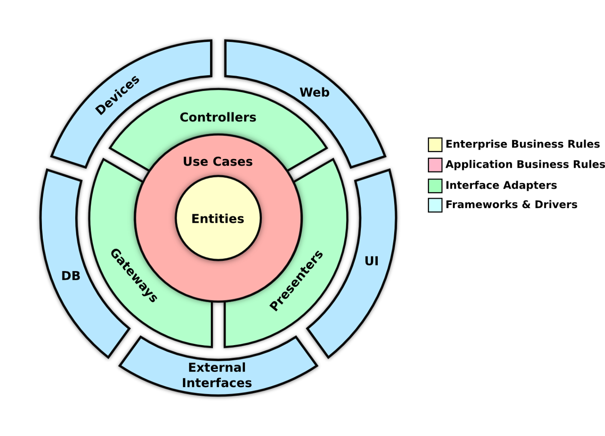

# ZEMOGA BACKEND CHALLENGE

## Description

Build a simple portfolio Java web app that displays the profile image, name, some text with the experience and a 5 tweet list of the user’s Twitter timeline.
The second part should be a very simple API with 2 endpoints of the profile content.

## Architecture

This project uses an architecture based on domain driven design (DDD)

### Requirements

- Docker
- MySQL
- JDK 11
- Maven

### Tech Stack

Name | Description | Useful Resources
--- | --- | ---
Maven | Is a software tool for the management and construction of Java projects.| [Official site](https://maven.apache.org/) resources.
Docker | Is an open source project that automates the deployment of applications within software containers, providing an additional layer of abstraction and application virtualization automation across multiple operating systems.| [Official site](https://www.docker.com/) resources.
JUnit | Is a set of libraries that are used in programming to unit test Java applications.| [Official site](https://junit.org/junit5/) resources.
OpenAPI | Is a specification for machine-readable interface files for describing, producing, consuming, and displaying RESTful web services.| [Official site](https://www.openapis.org/) resources.
JDK 11 | Is a set of open source libraries and tools that are used to develop Java applications.| [Official site](https://www.oracle.com/technetwork/java/javase/downloads/jdk11-downloads-5066655.html) resources.
Retrofit | Is a Java library that allows you to easily create RESTful HTTP APIs.| [Official site](https://square.github.io/retrofit/) resources.
Java 11 | Is a set of open source libraries and tools that are used to develop Java applications.| [Official site](https://www.oracle.com/technetwork/java/javase/downloads/jdk11-downloads-5066655.html) resources.
MySQL | Is a free and open-source relational database management system.| [Official site](https://www.mysql.com/) resources.
Mockito | Is a Java library that provides a mock object framework.| [Official site](https://mockito.org/) resources.
Spring Boot | Is a Java-based framework for building web and application applications.| [Official site](https://spring.io/projects/spring-boot) resources.
Jpa | Is a Java Persistence API (JPA) that provides a standard way to access and persist data in a database.| [Official site](https://www.oracle.com/technetwork/java/javase/tech/persistence/jpa/index.html) resources.
Flyway | Is a database migration tool that allows you to manage the changes to your database schema.| [Official site](https://flywaydb.org/) resources.
Logging Interceptor | Is a Java library that provides a logging interceptor for Spring Boot.| [Official site](https://www.baeldung.com/spring-boot-logging-interceptor) resources.

### Requirement before run

- This project has frontend project. You can access in this link: https://github.com/JaviAPS94/zemoga-challenge-frontend
- Run the frontend with the guidelines given in the Readme.

### How to run?

1. Clone the backend repository
2. In root directory run `docker build -t zemoga-backend .`
3. Run `docker run -dp 8080:8080 -e DB_HOST=host -e DB_PORT=3306 -e DB_NAME=schem -e DB_USER=user -e DB_PASSWORD=password -e TOKEN=Bearer\ AAAAAAAAAAAAAAAAAAAAAPNkCAEAAAAAmcfv%2BXE59uvAZ6pzjUv%2Fu68sBHI%3DpujwAAAwLsqbNQivymaOn0NveuOmKcRItDb5TUpn8fXY3iUMs6 zemoga-backend`

Notes: 
- Env variables DB_HOST, DB_NAME, DB_USER, DB_PASSWORD and TOKEN are required.
- Variables DB_HOST, DB_NAME, DB_USER, DB_PASSWORD are in the requirements document provided by Zemoga (I do not put them in the repository because I consider them confidential)
- For DB_NAME variable use schema public. I have not used the one provided by you since I have considered that it was dirty and would cause an impact on development.
- For TOKEN variable use: Bearer\ AAAAAAAAAAAAAAAAAAAAAPNkCAEAAAAAmcfv%2BXE59uvAZ6pzjUv%2Fu68sBHI%3DpujwAAAwLsqbNQivymaOn0NveuOmKcRItDb5TUpn8fXY3iUMs6 or get token with zemoga credentials with the endpoint https://api.twitter.com/oauth2/token?grant_type=client_credentials

### Run tests

- `mvn test` in root directory

### Contributors

- Alex Pinaida

### How long will it take me to do this challenge?

- Around 8 hours in the backend and around 2 hours in the frontend.

### Notes

#### Main route

{{host}}/api/zemoga-challenge

#### OpenAPI route

{{host}}/api/zemoga-challenge/swagger-ui.html

### License

This project is property of Alex Pinaida